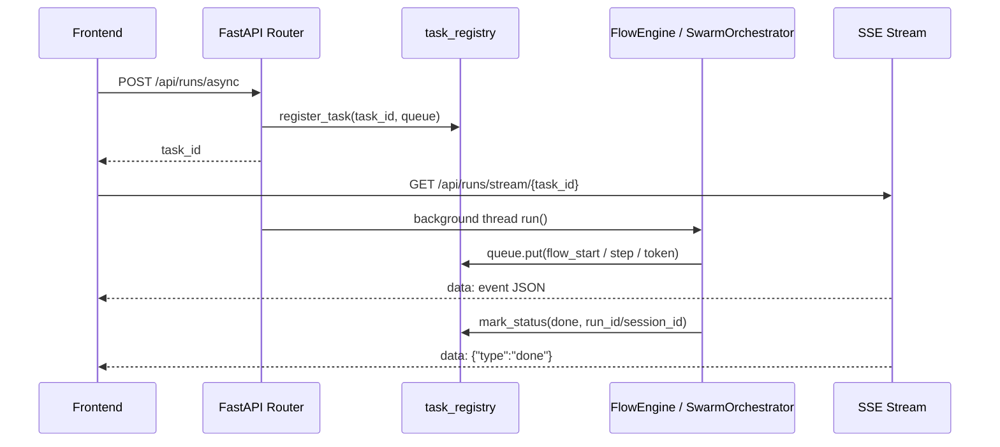
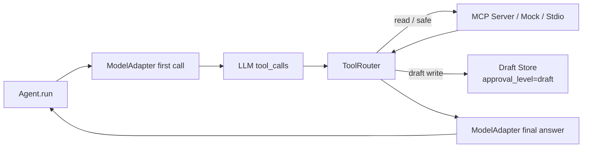
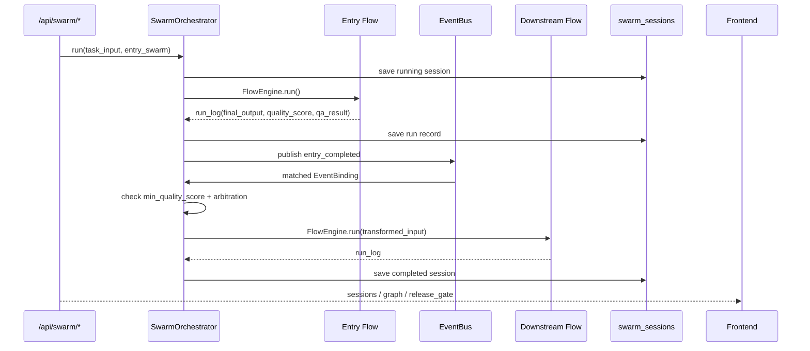

# 朝堂蜂群通信编排架构

整体名称：**朝堂蜂群通信编排架构**（Chaotang Swarm Communication Fabric）。

它不是单个接口，而是四层通信共同组成的主线系统：

- 前后端通信：FastAPI HTTP + SSE。
- 智能体通信：FlowEngine 上下文传递、step log、token callback。
- 工作流 skill 调用：Flow step 的 `execution_modes=A` + `skill_name`，可用则走 Claude/gstack skill，不可用则回退普通 Agent。
- 蜂群调用：SwarmOrchestrator + EventBus + quality gate + session replay。

## 总览图

```mermaid
flowchart LR
    FE[前端 / 朝堂 OS / API Client]
    API[FastAPI web.main\n统一后端入口]
    AUTH[web.deps\nAuth / Tenant]
    TASK[web.task_registry\n任务状态 / Queue / 审批事件]
    SSE[StreamingResponse\n/api/runs/stream/{task_id}]

    FLOW[FlowEngine\n单 Flow 编排核心]
    AGENT[Agent\n无状态 step 执行]
    MODEL[ModelAdapter\nLLM / LiteLLM / provider]
    TOOL[ToolRouter\nMCP / Mock / Stdio tools]
    SKILL[Skill subprocess\nexecution_modes=A + skill_name]
    OC[OpenClaw / spawn / dispatch\n长任务运行时]

    SWARM[SwarmOrchestrator\n跨蜂群编排]
    BUS[EventBus\n*_completed / *_failed]
    SESSION[swarm_sessions/*.json\n复盘会话]

    HARNESS[Harness Gates\n御史 / 质量 / 安全 / 部门协议]
    OBS[Production Events\n/api/observability/*\nrelease_observability_gate]
    LOGS[runs/ step logs / final_output / qa_result]

    FE -->|HTTP JSON| API
    FE <-->|SSE events| SSE
    API --> AUTH
    API --> TASK
    TASK --> SSE

    API -->|/api/runs/async no swarm| FLOW
    API -->|/api/swarm/run or swarm=true| SWARM
    API -->|/api/chaotang/*| TASK

    FLOW --> AGENT
    AGENT -->|plain text| MODEL
    AGENT -->|tools configured| TOOL
    FLOW -->|execution_modes=A| SKILL
    FLOW -->|step_type=openclaw/spawn| OC
    FLOW --> LOGS
    FLOW --> HARNESS
    FLOW --> OBS

    SWARM --> FLOW
    FLOW -->|run complete| BUS
    BUS -->|binding + min_quality_score| SWARM
    SWARM --> SESSION
    SWARM --> OBS
    SESSION -->|/api/swarm/sessions| API
    OBS -->|summary / release-gate| API
```

## 1. 前后端通信

主要入口：

- `POST /api/runs/async`：启动 Flow 或 Swarm 后台任务，返回 `task_id`。
- `GET /api/runs/stream/{task_id}`：前端用 SSE 读取 `flow_start / step_start / token / step / done / error`。
- `GET /api/runs/stream/{task_id}/status`：轮询兜底。
- `POST /api/runs/stream/{task_id}/approve|reject`：人工审批门。
- `POST /api/runs/stream/{task_id}/openclaw_reply|openclaw_proceed`：OpenClaw 交互门。
- `POST /api/swarm/run`：半异步启动蜂群编排，返回 `session_id`。
- `GET /api/swarm/config`：读取蜂群注册和绑定。
- `GET /api/swarm/sessions` / `GET /api/swarm/sessions/{id}`：读取蜂群复盘、图谱、`release_gate`。
- `GET /api/observability/events|summary|release-gate`：读取生产事件、红黄绿摘要和发布门禁。
- `POST /api/commercial-loop/golden-candidates/{id}/promote|reject`：兵部销售/售后样本审批，写入统一生产事件。
  事件必须携带丞相下一步和钦天监触发器，确保客户复用后的真实反馈能改变后续决策。

正常数据流：



## 2. 智能体通信

Flow 内部通信是“上下文累积 + step log”：

1. `FlowEngine.run(task_input)` 建立 `context={"task_input": ..., "steps":[]}`。
2. 每个 step 渲染前序上下文，交给 `Agent.run()`。
3. `Agent` 无状态，只看当前 system prompt + rendered context。
4. step 输出写入 `StepLog`，再追加到 `context["steps"]` 供下游 step 使用。
5. QA step 解析 `final_output / qa_result / quality_score`。
6. `run_log` 写入 runs 目录，并可自动提交到部门协议。

关键防线：

- `GuardRails`：执行前上下文/规则检查。
- `OutputLinter` / `StepAssertions`：执行后校验。
- `_parse_qa_output`：结构化 QA JSON，非法 JSON 进入 error 语义。
- `qa_result`：被 Swarm session 和 release gate 继续消费。

## 3. 工作流 Skill 调用

工作流 skill 调用由 `FlowEngine._execute_subprocess_step()` 承接：

```mermaid
flowchart TD
    STEP[Flow step]
    MODE{execution_modes[step_id] == A?}
    CLAUDE{claude CLI 可用?}
    SKILL{skill_name 对应 SKILL.md 存在?}
    SUB[claude -p --output-format stream-json]
    FALLBACK[Agent.run 普通模型路径]

    STEP --> MODE
    MODE -->|否| FALLBACK
    MODE -->|是| CLAUDE
    CLAUDE -->|否| FALLBACK
    CLAUDE -->|是| SKILL
    SKILL -->|否| FALLBACK
    SKILL -->|是| SUB
    SUB -->|text/result/error| STEP
```

当前主线规则：

- `skill_name` 禁止路径分隔符，避免目录穿越。
- skill 文件缺失或 Claude CLI 不可用时，自动 fallback 到方向 B。
- 流式 `text` 事件通过 `on_token(step_index, token)` 回前端。
- `config/flow_sdlc.yaml` 已声明 `autoplan / qa / cso` skill 调用点。

## 4. 工具 / MCP 调用

`Agent` 有 tools 时切入工具模式：



关键规则：

- 没有 tools 的 Agent 完全不受 ToolRouter 影响。
- 有副作用工具走 draft，不直接执行。
- 并发安全工具可并发执行，非并发安全工具串行。
- tool call 全部写入 `ToolCallLog`，可审计。

## 5. 蜂群调用

蜂群编排由 `SwarmOrchestrator` 负责：



当前绑定主线：

- `haolong_completed -> opc`
- `opc_completed -> product / ima / shiguan_archive`
- `product_completed -> quotation / ima / sourcing / shiguan_archive`
- `quotation_completed -> ima / shiguan_archive`
- `pack_rd_completed -> battery_stage_gate / shiguan_archive`
- `sdlc_completed -> gongbu_review`

蜂群 release gate：

- 任一 run `status=failed` -> `release_gate=blocked`。
- 任一 run `qa_result` 明确 fail -> `release_gate=blocked`。
- 否则 `release_gate=clear`。

## 6. 生产观测发布门禁

上线前增加统一事件层：

```mermaid
flowchart LR
    FLOW[Flow / Swarm / Health]
    BINGBU[Commercial Loop\n兵部销售/售后审批]
    EVENTS[production_events.jsonl]
    API[/api/observability/summary\n/api/observability/release-gate]
    CI[scripts/release_observability_gate.py]
    SHIP[发布候选]

    FLOW --> EVENTS
    BINGBU --> EVENTS
    EVENTS --> API
    EVENTS --> CI
    API --> SHIP
    CI -->|green only| SHIP
```

判定规则：

- `green`：有近期事件，且没有阻断或降级事件。
- `yellow`：无事件、健康降级、pending、timeout 或 evidence 不足，需要补证据。
- `red`：`gate_status=blocked`、失败事件、错误状态或 release readiness 阻断，不能发布。

## 7. 当前验证结论

本分支收口验证覆盖：

- FastAPI router 注册和基础 HTTP contract。
- `/api/runs/async` Flow 分支：后台执行、SSE 输出、状态落点。
- `/api/runs/async` Swarm 分支：`swarm_start / swarm_done / done` 输出。
- `/api/swarm/config` 和 `/api/swarm/sessions/{id}`：蜂群配置、图谱、release gate。
- FlowEngine skill fallback：Claude/skill 缺失不阻断普通 Agent 路径。
- ToolRouter：工具 schema、mock/stdin server、draft gate、tool log。
- SwarmOrchestrator：事件绑定、质量门控、仲裁、session replay。

结论：通信链路是通的；上线前风险集中在外部依赖可用性，而不是编排逻辑：

- LiteLLM / provider 未启动时，真实 LLM 调用会降级为运行失败或 health degraded。
- OpenClaw 网关不可达时，dispatch 路径按测试覆盖回退 spawn。
- MCP stdio server 超时会重启进程并把错误回喂模型。
- 生产推送前仍需保持 `pytest -q`、`validate_flows.py`、御史漂移监控、secret 扫描为硬门禁。
- 生产推送前新增 `python scripts/release_observability_gate.py`；没有生产事件默认为 yellow，不可当作 green。
- 涉及生产、不可逆动作、多蜂群主链路或外部客户承诺的变更，必须先形成钦天监简报，再进入执行、合并或上线。
