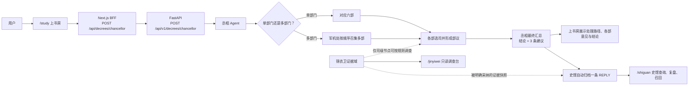

# 决策 0020：下旨、锦衣卫证据与史馆回奏业务流基线

## ADR 0028

## Status

Accepted — 2026-07-23

## Context

当前仓库正在从 `dev` 的视觉与旧实现中恢复功能。旧页面包含静态展示、旧 API、模拟数据和不同的任务模型，不能作为当前业务事实。用户已明确确认下旨、会审、锦衣卫证据和史馆归档的真实流程，并要求将其作为所有参与者必须遵循的项目基线。

## Decision

以下流程是当前业务流的唯一权威描述：

强制规则：

- 下旨是唯一业务入口。丞相将单部门旨意直接交给对应六部；跨部门旨意由军机处按顺序串行会审。
- 每个部门先选择相关司，形成司议，再形成部议；丞相最终输出结论和恰好三条建议。
- 锦衣卫不是通用搜索入口。只有司级节点可按受控规则发起调查；外网默认关闭。
- `/jinyiwei` 仅展示调查汇总、列表和详情，不能触发调查或修改证据。
- 只有被明确采纳的证据，才能以不可变快照附到对应史馆 `REPLY`。
- 史馆只承认 `MEMORIAL`（真实上奏或呈报）和 `REPLY`（办理旨意或奏折的回奏）两类档案。一次下旨自动产生恰好一条 `REPLY`，不得伪造 `MEMORIAL`。
- `/shiguan` 用于当前用户拥有档案的查看、复盘状态和相似旧案召回。

所有 AI、自动化与后续实现任务必须先读取并遵循本 ADR。未经当前用户明确授权，不得修改本 ADR 或以代码、任务文档、测试、提示词、旧 `dev` 实现绕过其规则。

## Consequences

- 收益：前后端契约、页面功能和 AI 行为拥有同一条明确业务基线，避免把旧实现当成产品需求。
- 收益：harness 对本 ADR 的 SHA-256 完整性校验会阻止静默篡改；根级 `AGENTS.md` 将其作为所有 AI 的强制入口规则。
- 限制：本地 harness 只能检测文件内容是否被改写，不能阻止拥有仓库写权限的人同时修改 ADR、校验脚本或关闭检查。
- 治理：若业务规则必须变化，必须由用户明确授权，新增或修订 ADR，并在同一变更中更新完整性基线、任务契约与验证证据；远端分支保护和仓库写权限需由仓库管理员配置。

## Verification

- `node scripts/check_harness.mjs`
- `node scripts/check_harness.mjs --self-test`
- `node .agents/hooks/check-harness.mjs --self-test`
- `node .agents/skills/product-flow/scripts/run-claude-delivery.mjs --self-test`
- `git diff --check`
