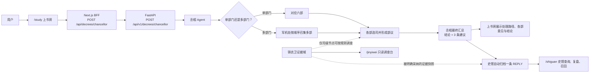

# 上书房下旨、锦衣卫证据与史馆归档流程

## Status

Draft

## Product Definition

- 用户确认：2026-07-23。当前产品业务流以 `docs/decisions/0020-decree-evidence-flow-governance-baseline.md` 为唯一权威描述；它优先于此前关于“大殿案件中心”或“锦衣卫转案件”的讨论。
- 问题：后续恢复 `dev` 功能时，不能把旧页面的静态展示、旧 API、模拟任务或泛化案件工作流误当作当前业务边界。
- 目标用户：登录后的上书房用户，以及在既有权限内使用锦衣卫和史馆的用户。
- 目标：保持下旨作为唯一业务入口；在当前 Next.js BFF、FastAPI 丞相/六部/军机处、锦衣卫证据域和史馆之间形成可追溯闭环。
- 核心规则：丞相把单部门旨意直接交给对应六部；跨部门旨意由军机处按顺序串行会审。每个部门先选择相关司并形成司议，再形成部议；最终由丞相输出结论和恰好三条建议。
- 锦衣卫规则：锦衣卫不是通用搜索入口。仅司级节点可按受控规则发起调查，外网默认关闭；只有被明确采纳的证据才以不可变快照附到史馆 `REPLY`。`/jinyiwei` 仅展示调查汇总、列表和详情，不能触发调查或修改证据。
- 史馆规则：史馆只承认 `MEMORIAL`（奏折）与 `REPLY`（回奏）两类档案。一次下旨自动产生一条 `REPLY`，不得伪造 `MEMORIAL`。
- 非目标：不引入大殿创建或推进案件的能力；不把锦衣卫做成独立立案入口、主动调查入口或证据编辑入口；不迁移 `dev` 的旧接口、客户端直连、模拟数据、SSE 蜂群或任务状态机。

## Acceptance Criteria

- [ ] 用户仅能从 `/study` 发起下旨；浏览器经同源 BFF 调用 FastAPI，且不暴露会话或后端地址。
- [ ] 丞相先判定单部门或多部门；单部门进入对应六部，多部门由军机处按顺序召集多个部门。
- [ ] 每个参与部门先选择适用司级节点，再形成部议；丞相返回最终结论和恰好三条建议。
- [ ] 上书房展示真实处理路径、参与部门、司级/部级意见及最终结论。
- [ ] 锦衣卫仅在司级规则明确触发时作为证据域参与；`/jinyiwei` 是只读调查台，不提供独立立案或直接改写会审结论的能力。
- [ ] 史馆只接受 `MEMORIAL` 和 `REPLY` 两类档案；下旨最终结果自动写入恰好一条 `REPLY`，不自动伪造 `MEMORIAL`。
- [ ] 被明确采纳的锦衣卫证据以不可变快照附到对应 `REPLY`，并能追溯其司级调查来源。
- [ ] `/shiguan` 继续只展示当前用户拥有的档案，并支持查询、复盘与旧案召回。
- [ ] `/jinyiwei` 仅展示调查汇总、列表和详情；前端无调查触发、外网搜索或证据修改操作。

## Delivery Constraints

- 范围：后续实现按上书房、后端会审、锦衣卫证据域、史馆归档、只读调查台分批登记允许路径。
- 兼容性：保留既有认证、BFF、`POST /api/decrees/chancellor`、`POST /api/v1/decrees/chancellor`、六部/军机处路由与史馆所有权隔离。
- 风险与限制：当前史馆的档案类型及自动归档行为与此规则不一致；后续必须通过契约迁移和测试收敛为 `MEMORIAL`/`REPLY`，不能复用或假定 `dev` 旧实现可用。外网默认关闭，任何未来外网接入都需要单独的用户授权与任务契约。
- 技能计划：brainstorming、writing-plans、test-driven-development、verification-before-completion。
- Codex-only：是；禁止 Claude CLI、Claude runner 与 gstack-claude。

## Affected Modules

- 模块：上书房下旨、丞相分流、六部/司级会审、军机处、受控锦衣卫证据域、史馆 `MEMORIAL`/`REPLY` 归档与召回、只读调查台。
- 允许路径：待架构盘点后分批登记。
- 依赖模块：当前认证与会话、Next.js BFF、FastAPI decree API、现有史馆存储和所有权隔离。

## Technical Plan

- 待架构盘点后填写。实施前必须先将本任务由用户明确确认至 `Ready`，并确定 `REPLY` 的契约迁移、不可变证据快照和司级受控调查规则。

## Implementation Report

- 尚未实施。

## Acceptance Review

- 验收结果：Pending
- 验收证据：用户已确认业务流；尚未进入实现验收。
- 未通过项：无。
