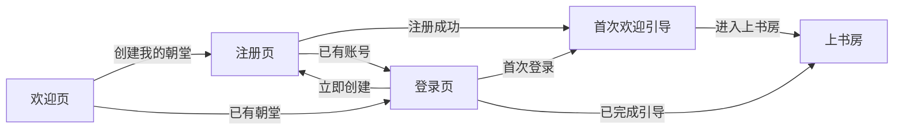

# 登录、注册与欢迎入口设计

## 背景与目标

朝堂 OS 当前所有业务页面默认服务于“皇帝”这一唯一人工角色，丞相、六部、军机处、锦衣卫与史馆均由 Agent 承担。新增账号入口后，系统允许多个用户注册，但每位用户拥有彼此隔离的独立朝堂，并在自己的朝堂中担任皇帝。

本次设计只补充欢迎页、登录页、注册页和首次欢迎引导，不改变既有上书房、六部、锦衣卫、军机处与史馆的职责。

## 产品模型

- 一个用户对应一个独立朝堂工作区。
- 注册成功即创建该用户的朝堂，不提供加入其他朝堂或邀请成员功能。
- 旨意、案卷、Agent 办理结果、锦衣卫调查及史馆档案均按朝堂隔离。
- 用户登录后只看到自己的朝堂数据。
- 所有注册用户在各自朝堂中都是皇帝，不新增人工部级、司级或军机处角色。

## 页面与流程

### 1. 欢迎页

目标：说明产品价值，并让新用户和老用户明确选择下一步。

主要内容：

- 品牌与一句话价值：“一句话下旨，Agent 自动办理，全程可查可追溯”。
- 三项核心能力：上书房下旨、Agent 分层办理、史馆永久归档。
- 主操作“创建我的朝堂”，进入注册页。
- 次操作“已有朝堂，直接登录”，进入登录页。
- 不展示业务 Header 菜单，避免未登录用户误以为可以进入内部模块。

### 2. 注册页

目标：以最少信息创建账号和独立朝堂。

字段：

- 朝号或称谓：作为朝堂显示名称，例如“景和朝”。
- 邮箱：作为唯一登录账号。
- 密码：用于登录，页面展示基本强度要求。
- 同意服务条款与隐私说明。

交互：

- 主操作“创建朝堂”。
- 次操作“已有账号，去登录”。
- 成功后直接进入首次欢迎引导，不重复要求登录。
- 邮箱已存在、密码不合规或网络失败时在对应字段附近给出明确提示，保留用户已填写内容。

### 3. 登录页

目标：让已有用户快速返回自己的朝堂。

字段：

- 邮箱。
- 密码。
- 可选“保持登录”。

交互：

- 主操作“进入朝堂”。
- 次操作“还没有朝堂，立即创建”。
- 提供“忘记密码”入口，但本轮原型只展示入口，不扩展独立找回密码页面。
- 登录成功后，完成过首次引导的用户直接进入上书房；未完成的用户进入首次欢迎引导。

### 4. 首次欢迎引导

目标：让新用户在进入系统前理解核心心智模型，而不是学习所有页面。

在一个页面内展示三个步骤，不拆成多个页面：

1. 在上书房用一句话下旨。
2. 丞相与各 Agent 自动分流、调查、会审并形成正式回奏。
3. 完成案卷进入史馆，可查询、召回与复盘。

页面显示新创建的朝堂名称，主操作为“进入上书房”。用户完成后不再自动看到此页。

## 信息架构与跳转

## 视觉与原型规则

- 沿用 V4 的黑色 Header、暖白背景、白色内容卡、赭红强调色和 Noto Sans SC。
- 欢迎页、登录页、注册页和首次欢迎引导各保留一个主页面，不为错误态、成功态或步骤建立重复编号页面。
- 登录与注册使用同一套左右分栏结构：左侧品牌与产品价值，右侧表单。
- 首次欢迎引导使用一张聚焦卡片呈现三步，不展示内部业务模块菜单。
- 登录成功或引导完成后才进入带有完整业务 Header 的上书房。

## 原型验收标准

- Figma 中新增且仅新增四个入口主页面：欢迎、登录、注册、首次欢迎引导。
- 欢迎页可以分别进入登录页和注册页。
- 登录页与注册页可以相互跳转。
- 注册成功路径进入首次欢迎引导；登录成功路径在原型中直接进入上书房。
- 首次欢迎引导点击“进入上书房”后进入现有 V4 上书房页面。
- 四个入口页面与现有 V4 视觉语言一致，文本无裁切、重叠或缺失字体。
- 不出现人工选择六部、司级、军机处或锦衣卫身份的入口。

## 非目标

- 团队成员邀请、共享朝堂或多角色 RBAC。
- 第三方登录、手机号登录、验证码登录和企业单点登录。
- 完整找回密码流程、邮件验证流程或真实认证后端。
- 修改既有业务页面和 Agent 工作流。
