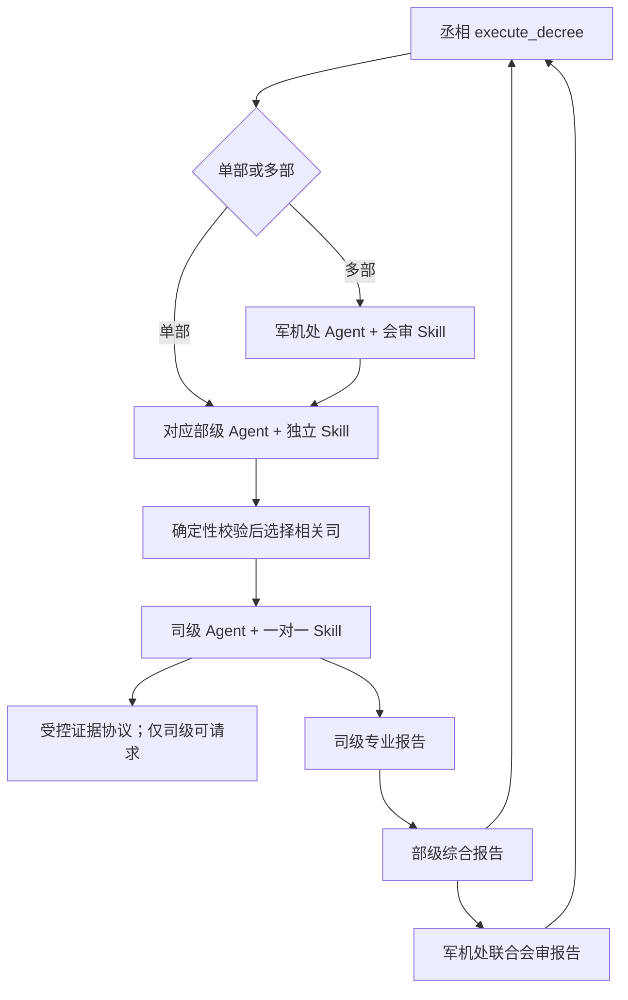

# 全部下游 Agent 独立运行时 Skill 设计

## 决策摘要

在不改变现有下旨、会审、取证和归档业务流的前提下，为军机处、六部和 39 个司各建立一个
一对一绑定的独立 Runtime Skill，共新增 46 个 Skill。丞相继续使用已经运行的
`consult`、`draft_decree` 和 `execute_decree`，不纳入本次重构。

本设计采用“独立 Skill 定义包 + 共享执行内核 + 分层报告协议”：每个 Agent 独立拥有
身份、版本、职责、输入、专业方法、数据需求、服务权限、报告契约和测试；模型调用、结构化
校验、错误映射和审计等通用机制只实现一次。

这些 Skill 属于产品后端运行时，不是开发工具使用的 `.agents/skills/*/SKILL.md`。

## 问题与现状

当前正式办理已经具备丞相、军机处、六部和 39 个司的调用链，但下游能力仍存在三个缺口：

- 军机处和六部是普通 Agent 函数，没有统一的 Skill ID、版本、服务白名单和报告契约；
- 39 个司虽然都有身份和职责档案，但共享同一个调用器，不能证明每个司都有独立专业 Skill；
- 现有 20 个静态 capability 分布在 16 个司，其余 23 个司没有能力包，而且 capability 只是
  Prompt 片段，不是可注册、可审计和可独立测试的 Runtime Skill。

司级 Agent 当前由六部代码在循环中调用，并不是 39 个 LangGraph Node。本设计不以 Skill 化
为理由改变图拓扑。

## 目标

- 军机处、6 个部和 39 个司分别绑定唯一、启用、可版本化的 Runtime Skill；
- 司级 Agent 能根据本司专业方法分析材料和数据，产出结构化专业报告；
- 部级 Agent 能选择相关司、校验并综合司级报告，产出部级综合报告；
- 军机处能组织跨部顺序会审，保留共识与分歧，产出联合会审报告；
- 每次调用都能追溯到 Agent、Skill、版本、输入引用、证据引用和结果状态；
- 保持丞相现有 Runtime Skill、API、前端和 ADR 0028 业务流兼容。

## 非目标

- 不为 46 个 Skill 分别复制模型客户端、超时、重试、结构化解析或审计实现；
- 不把 39 个司改造成 39 个 LangGraph Node 或独立子图；
- 不允许军机处或六部绕过司级 Agent 调用锦衣卫、MCP或外网；
- 不改变下旨入口、一次性拟旨授权、参与部门顺序、史馆归档或三条最终建议；
- 不新增前端页面、API、生产写入、MCP 数据源或长期记忆；
- 不把角色语气、人格描述当成专业 Skill 的主要内容。

## 选定架构

### 一对一绑定

每个下游 Agent 只有一个默认专业 Skill，每个 Skill 也只能属于一个 Agent：

```text
AgentIdentity 1 ── 1 RuntimeSkillDefinition
                         │
                         ├── ProfessionalMethod
                         ├── DataRequirement
                         ├── ServicePolicy
                         ├── ReportContract
                         └── AuditPolicy
```

注册表启动时必须拒绝重复 `skill_id`、重复 Agent 绑定、未知 Agent、缺失版本、空专业方法、
空报告契约和非法服务权限。已启用的 46 个下游 Agent 必须达到 100% Skill 覆盖。

### 共享执行内核

共享内核只负责通用机制：

- 根据可信 Agent 身份解析唯一 Skill；
- 校验并裁剪输入上下文；
- 注入 Skill 明确允许的领域服务；
- 组合公共安全指令与 Skill 专业指令；
- 执行结构化模型调用；
- 校验分层报告契约；
- 映射稳定、脱敏的失败代码；
- 写入 Skill ID、版本、调用链和副作用审计。

共享内核不得包含“某司应该如何分析”的业务判断。专业指标、分析步骤、必需数据和领域风险
必须属于对应 Skill 定义。

### 建议代码边界

```text
backend/app/agents/runtime_skills/
├── models.py                 # 公共 Skill、调用与审计模型
├── registry.py               # 46 个下游 Skill 的注册和一对一校验
├── executor.py               # 共享执行内核
├── reports.py                # 司、部、军机处三层报告基础契约
└── roles/
    ├── junjichu.py           # 1 个会审 Skill
    ├── ministries.py         # 6 个部级 Skill
    └── bureaus/
        ├── libu.py           # 6 个司级 Skill
        ├── hubu.py           # 7 个司级 Skill
        ├── libu_rites.py     # 6 个司级 Skill
        ├── bingbu.py         # 6 个司级 Skill
        ├── xingbu.py         # 7 个司级 Skill
        └── gongbu.py         # 7 个司级 Skill
```

第一阶段按领域文件聚合定义，不创建 46 套重复 Python 包。独立性由一对一注册、独立契约、
版本和测试保证，而不是由目录数量保证。未来某个 Skill 需要专属脚本或大型知识文件时，再将
该定义无损拆成独立目录。

## Runtime Skill 契约

每个 Skill 至少定义：

```text
RuntimeSkillDefinition
├── skill_id
├── version
├── agent_id
├── layer                    # bureau | ministry | council
├── purpose
├── responsibility_scope
├── required_inputs
├── optional_inputs
├── data_requirements
├── analysis_procedure
├── required_findings
├── allowed_services
├── forbidden_actions
├── report_contract
├── failure_policy
└── audit_policy
```

专业指令使用中等自由度：固定分析步骤、数据和输出门槛，但允许模型根据议题裁剪不适用项。
权限、证据、授权、结构化输出和失败关闭规则使用低自由度的确定性代码。

## 分层数据流



LangGraph 第一阶段仍只编排现有丞相流程节点。六部继续在现有调用路径中选择司，司级 Skill
继续由受控循环执行。以后只有在需要司级并发状态、单司暂停恢复或图级重试时，才另立 ADR
评估子图化。

## 报告协议

### 公共报告信封

三层报告共同包含：

```text
report_id
request_id
parent_report_id?
agent_id
skill_id
skill_version
subject
executive_summary
input_refs[]
data_sources[]
evidence_refs[]
data_gaps[]
evidence_sufficiency        # sufficient | partial | insufficient
status                      # completed | degraded | failed
created_at
```

`evidence_sufficiency` 只是材料充分度，不表示未经校准的概率或置信百分比。报告不得把推断伪装
成事实；事实、假设和建议必须能够区分。

### 司级专业报告

额外包含：

- `analysis`：按本司方法完成的数据和材料分析；
- `professional_findings`：本司职责范围内的发现；
- `risks`：风险、触发条件和潜在影响；
- `recommendations`：可执行但不越权的建议；
- `evidence_requests`：仅在事实缺口满足证据协议时产生；
- `out_of_scope_items`：应交其他司处理的事项。

无数据时不能编造分析结果，应返回缺口、可执行的补数建议和 `degraded` 状态。没有相关性时
返回受控的“不适用”，不能为了填满模板生成虚假内容。

### 部级综合报告

额外包含：

- `selected_bureaus` 与确定性校验后的选择理由；
- `bureau_report_refs`；
- `shared_findings`；
- `conflicts`，包括无法消解的司级意见；
- `cross_bureau_impacts`；
- `ministry_position`；
- `unresolved_items`。

部级 Skill 只能综合和裁决本部职责内事项，不得代替未调用的司虚构专业报告，也不得自己请求
锦衣卫调查。

### 军机处联合会审报告

额外包含：

- `participating_ministries` 和批准的会审顺序；
- `ministry_report_refs`；
- `consensus`；
- `disagreements`；
- `cross_ministry_dependencies`；
- `joint_options`；
- `matters_for_chancellor_decision`。

军机处必须保留真实分歧，不得为了生成单一答案删除异议；不得扩大批准部门集合或改变顺序。

## 46 个 Skill 目录

### 军机处

| Agent | Skill ID | 核心职责 |
| --- | --- | --- |
| 军机处 | `conduct-joint-ministry-review` | 按批准顺序组织跨部会审，比较共识、分歧、依赖和联合方案 |

### 六部

| Agent | Skill ID | 核心职责 |
| --- | --- | --- |
| 吏部 | `synthesize-workforce-governance` | 综合任用、招聘、劳关、薪酬、制度与协同意见 |
| 户部 | `synthesize-finance-governance` | 综合预算、资金、报价、融资、审计、会计与投资意见 |
| 礼部 | `synthesize-communications-governance` | 综合品牌、公关、客户沟通、内容、政企与体验意见 |
| 兵部 | `synthesize-commercial-governance` | 综合报价推进、线索、渠道、客户、竞情与增长意见 |
| 刑部 | `synthesize-risk-governance` | 综合合同、合规、风控、证据、争议、知识产权与制度意见 |
| 工部 | `synthesize-delivery-governance` | 综合产研、技术、物料、进度、质量、现场与承诺意见 |

### 吏部六司

| Agent | Skill ID | 专业分析范围 |
| --- | --- | --- |
| 任免司 | `analyze-appointment-fit` | 任免、晋升、职级、调岗和职责匹配 |
| 招聘司 | `analyze-recruitment-pipeline` | 招聘需求、岗位缺口、候选人匹配和面试推进 |
| 劳关司 | `analyze-labor-relations` | 入离调转续全过程劳动关系风险 |
| 薪酬司 | `analyze-compensation-equity` | 薪酬区间、调薪、奖金、预算和内部公平性 |
| 制度司 | `analyze-hr-policy` | 人事制度、流程规则、适用条款和例外处理 |
| 协同司 | `analyze-workforce-coordination` | 责任人、跨司链路、卡点、逾期和催办 |

### 户部七司

| Agent | Skill ID | 专业分析范围 |
| --- | --- | --- |
| 预算司 | `analyze-budget-performance` | 预算、预测、费用控制和经营分析 |
| 出纳司 | `analyze-cash-safety` | 现金安全、回付款、账期和资金安全垫 |
| 盐铁司 | `analyze-pricing-economics` | 报价、成本拆解、毛利底线和异常价格 |
| 融资司 | `analyze-financing-options` | 资金缺口、融资方案、资金成本、还款压力和红线 |
| 审计司 | `analyze-financial-controls` | 异常报销、重复付款、缺证费用和流程绕行 |
| 会计司 | `analyze-accounting-position` | 收入、成本、费用、科目、项目归集、税务和月结 |
| 投资司 | `analyze-investment-case` | 收益测算、风险、退出路径、行情、市场数据和估值 |

### 礼部六司

| Agent | Skill ID | 专业分析范围 |
| --- | --- | --- |
| 品牌司 | `analyze-brand-consistency` | 品牌表达、视觉资产、语气一致性和品牌风险 |
| 公关司 | `analyze-public-relations` | 舆情、事实核查、回应口径和危机升级 |
| 客户沟通司 | `analyze-customer-communications` | 客户话术、沟通目标、禁用话术和承诺边界 |
| 内容司 | `analyze-content-quality` | 内容质量、事实校验、发布门禁和修改建议 |
| 政企司 | `analyze-government-enterprise-relations` | 政企合作、材料准备、合规边界和跟进计划 |
| 体验司 | `analyze-user-experience` | 用户反馈、问题优先级、优化建议和结果验证 |

### 兵部六司

| Agent | Skill ID | 专业分析范围 |
| --- | --- | --- |
| 报价司 | `analyze-sales-opportunity` | 商机阶段、报价动作、赢率和阻塞点 |
| 线索司 | `analyze-lead-acquisition` | 市场活动、线索质量、获客成本和投放复盘 |
| 渠道司 | `analyze-channel-performance` | 渠道合作、报备、成交归属、返佣和冲突 |
| 客户司 | `analyze-customer-health` | 客户健康、续约、投诉、交付问题和关键联系人 |
| 竞情司 | `analyze-competitive-position` | 竞品、价格战风险、输赢原因和竞争策略 |
| 增长司 | `analyze-growth-funnel` | 漏斗转化、增长瓶颈、实验队列和优先级 |

### 刑部七司

| Agent | Skill ID | 专业分析范围 |
| --- | --- | --- |
| 合同司 | `analyze-contract-risk` | 合同条款、签署门禁、缺失条款和模板偏离 |
| 合规稽查司 | `analyze-compliance-posture` | 合规规则、风险等级、整改要求和稽查结论 |
| 风控司 | `analyze-enterprise-risk` | 整体风险、趋势、控制措施和准入建议 |
| 缺证核查司 | `analyze-evidence-integrity` | 证据完整性、授权链、审批状态和越权检查 |
| 争议处置司 | `analyze-dispute-resolution` | 争议事实链、双方诉求、证据强弱和处置策略 |
| 知识产权司 | `analyze-intellectual-property` | 知识产权归属、授权、侵权风险和保护建议 |
| 制度司 | `analyze-legal-policy` | 法律制度、处罚风险、整改路径和豁免条件 |

### 工部七司

| Agent | Skill ID | 专业分析范围 |
| --- | --- | --- |
| 产研司 | `analyze-product-strategy` | 需求、产品方案、用户价值、范围和优先级 |
| 技术司 | `analyze-technical-feasibility` | 技术可行性、架构风险、研发成本、依赖和技术债 |
| 物料司 | `analyze-supply-readiness` | 库存、采购、供应商、缺料风险和替代方案 |
| 进度司 | `analyze-delivery-schedule` | 里程碑、排期、延期风险、责任人和交付预测 |
| 质量司 | `analyze-quality-readiness` | 质量检查、缺陷、验收证据、返工和质量裁决 |
| 现场司 | `analyze-field-conditions` | 现场事实、客户反馈、处理进度和现场证据 |
| 承诺司 | `analyze-commitment-fulfillment` | 客户承诺、兑现状态、来源、责任人和越权风险 |

## 现有 capability 迁移

现有 20 个 capability 不再作为平行的第二套能力注册表。迁移规则如下：

- 将 capability 的 purpose、deliverable 和 guardrail 合入所属司的独立 Skill；
- 同一司的多个 capability 成为该 Skill 内的受控分析模式，而不是多个默认 Skill；
- 保留旧 capability ID 到新 Skill ID 的内部兼容映射，直到调用方和测试完成迁移；
- 原来没有 capability 的 23 个司根据现有职责补齐专业方法和报告契约；
- 迁移期间禁止同一次调用同时走旧 capability Prompt 和新 Skill Prompt，避免规则叠加漂移。

## 服务与权限

### 司级

司级 Skill 可以使用当前请求材料、上级任务、批准的数据摘要、同一调用链中的受控上下文，
并在规则满足时通过 Evidence Protocol 提出调查请求。Skill 不直接取得 MCP 客户端、凭证或
任意工具名，外网默认关闭。

### 部级

部级 Skill 可以调用本部司级 Agent、读取它们的报告并形成部议。它不能直接调用锦衣卫、
MCP、史馆写入或其他部的司级 Agent。

### 军机处

军机处 Skill 只能按批准顺序调用参与部门并综合部级报告。它不能自行添加部门、改序、直接
调用司级 Agent或调查证据。

所有涉及报价、合同、付款、签署、发布、部署、招聘和外部承诺的输出仍然只是分析或草案，
不能声称不可逆动作已经执行。

## 错误与降级

- 未注册 Skill、Agent/Skill 不匹配、非法版本或越权服务：在模型调用前失败关闭；
- 输入缺少必填标识或上级任务：返回稳定契约错误，不生成报告；
- 专业数据不足：生成 `degraded` 报告，列出数据缺口和补数建议；
- 模型结构化输出无效：按现有受控策略有限重试，最终返回脱敏失败码；
- 单司失败：部级报告明确记录缺失司及影响，不伪造其意见；是否允许继续由既有编排策略决定；
- 多部会审中某部失败：军机处记录缺失部门，不把不完整会审标为完整成功；
- 证据调用失败：保留调查失败状态和事实缺口，不把未获取证据写成已证实事实。

## 审计

每次调用至少记录：

```json
{
  "request_id": "...",
  "parent_report_id": "...",
  "agent_id": "hubu-accounting",
  "skill_id": "analyze-accounting-position",
  "skill_version": "1.0.0",
  "input_refs": [],
  "evidence_refs": [],
  "allowed_services": [],
  "status": "completed",
  "failure_code": null,
  "duration_ms": 0
}
```

审计不得记录凭证、完整敏感原文或第三方底层异常。历史报告必须保留当时的 Skill 版本，升级
一个 Skill 不得改变历史报告语义。

## 实施分解

本范围较大，实施应分成四个可独立验收的阶段，但共用本设计：

1. 建立公共契约、注册表、共享执行器和三层报告基础模型；
2. 接入军机处与六部 7 个 Skill，保持现有编排和响应兼容；
3. 按六部逐批接入 39 个司级 Skill，并迁移 20 个 capability；
4. 完成端到端兼容、审计、文档和 10 轮最终验收。

每一阶段都必须保持主流程可运行，不能先删除旧 capability 再等待新 Skill 补齐。

## 测试与验收

### 注册完整性

- 新增 Skill 总数恰好为 46：军机处 1、六部 6、司级 39；
- 每个下游 Agent 恰好绑定一个启用 Skill；
- Skill ID 全局唯一，版本符合约定；
- 不存在未知 Agent、跨部绑定或无报告契约的 Skill；
- 39 个司的职责注册表与 Skill 注册表一一对应。

### 专业差异性

- 每个司至少有独立的数据需求、分析步骤、必需发现和风险检查；
- 抽样输入不能仅通过替换 Agent 名称得到相同报告；
- 现有 20 个 capability 均能映射到所属新 Skill；
- 原来缺少 capability 的 23 个司均可生成合规的专业报告。

### 权限与证据

- 只有司级 Skill 能产生受控证据请求；
- 军机处和六部无法取得锦衣卫或 MCP 服务；
- 任一 Skill 请求未授权服务时，在执行前失败；
- 未采纳证据不能附加到史馆 `REPLY`；
- 外网仍默认关闭，原始 MCP 异常和凭证不泄露。

### 报告与降级

- 三层报告均通过结构化契约校验；
- 数据不足产生明确的 `degraded` 报告而非虚构数据；
- 部级报告引用真实司级报告并披露冲突和缺失；
- 军机处报告保持批准部门和顺序并披露跨部分歧；
- Skill ID 和版本能从最终调用链追溯。

### 兼容回归

- 丞相三个现有 Runtime Skill 行为保持不变；
- 单部与多部正式下旨路径保持不变；
- 现有 API、前端、一次性授权、最终三条建议和史馆归档保持兼容；
- ADR 0028 完整性与 harness 检查继续通过；
- 当前相关后端测试通过，并增加新注册、权限、报告和迁移测试。

### 最终验收

同一最终代码、配置和验收命令必须连续完整通过至少 10 轮；任一轮失败，或代码、配置、
验收流程发生实质变化，均从第 1 轮重新计数。逐轮记录命令、PASS/FAIL 和证据。

真实模型、真实 MCP、生产数据库、生产写入和付费外部服务不因本设计自动获得授权；如需纳入
最终验收，必须单独确认环境和权限。

## 完成定义

- 46 个下游 Agent 均存在一对一独立 Runtime Skill；
- 每个 Skill 都有独立专业方法、数据需求、权限、报告契约、版本和测试；
- 司级、部级和军机处分别产出专业报告、综合报告和联合会审报告；
- 现有 20 个 capability 完整迁移，剩余 23 个司能力补齐；
- 现有 LangGraph 拓扑、丞相 Skill、API、前端和 ADR 0028 业务流未被改变；
- 新旧行为经过兼容回归和连续 10 轮最终验收。
