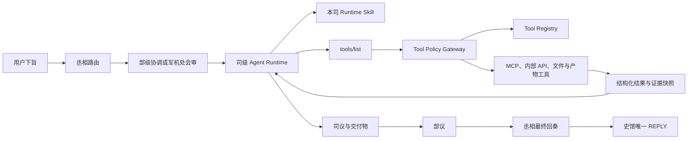

# 司级 Agent 权限内动态工具发现设计

日期：2026-08-11
状态：已由用户确认，待书面复核

## 背景

系统已经为 39 个司级 Agent 建立独立 Runtime Skill、Tool Policy 和受控 Tool Use，但当前工具目录固定为少量通用只读能力，业务数据还可能在司级 Agent 接手前被专用解析器预检。会计司生成 2025 年管理层综合财务报表时，固定 Excel 表头和行结构解析失败，导致数据没有进入 Agent 工具循环，最终又被界面误报为模型调用失败。

本设计把该问题作为通用架构问题解决：所有司级 Agent 在收到旨意后，根据本司身份、当前旨意授权、数据域和环境策略动态发现可用工具，自主选择 Skill 和工具完成办理。会计司只是第一个端到端样板，不建立专用旁路。

## 已确认的产品选择

- 采用权限内动态发现：Agent 通过 `tools/list` 获得当前任务允许的工具。
- 已授权工具全部自动调用，不逐次请求人工确认。
- 数据含义存在歧义时，采用最高置信度解释并继续办理，同时记录和披露依据与风险。
- 工具失败时自动修正参数、改变策略或选择替代工具，并进行有限重试。
- 丞相、部级 Agent 和军机处继续只负责路由、综合与会审；只有司级 Agent 可以发起受控工具调用。

“全部自动”仅表示不逐次弹出确认，不表示模型拥有授权权。工具网关仍在每次调用前执行确定性权限校验，模型不能扩张权限、选择凭证或绕过数据域边界。

## 方案比较

### 方案 A：继续为每个业务建立前置解析器

优点是单一格式下行为确定；缺点是格式稍有变化就会在 Agent 接手前失败，每新增一个司或数据源都要复制专用管线。否决。

### 方案 B：每个司固定配置全部工具

权限明确，但工具变化需要同步修改每个司的配置并重新发布，无法根据实时健康状态和当前旨意收缩能力。可作为兼容模式，不作为目标架构。

### 方案 C：权限内动态发现（采用）

统一注册工具描述，系统按司级身份、旨意、数据域、环境策略和实时可用状态生成任务级工具目录。Agent 只看得到该目录，并在受控循环中自动调用。该方案兼顾可扩展性、专业差异和最小权限。

## 总体架构



本次可见工具集合为：

```text
司级角色允许工具
∩ 当前旨意授权范围
∩ 当前数据域权限
∩ 当前环境安全策略
∩ 工具实时可用状态
```

丞相、军机处和部级节点不获得 Tool descriptor、MCP 会话、凭证或原始工具结果。上层只接收结构化司议及被采纳的证据引用，保持 ADR 0028 的业务主链和单一最终 `REPLY` 不变。

## 组件边界

### Bureau Agent Runtime

承载司级模型循环，读取系统确定的 Agent、Skill、旨意和预算上下文。模型可以选择目录中的工具和参数，但不能声明权限、凭证、provider、审计状态或执行器。

### Runtime Skill

定义本司的专业办理规程、数据需求、分析步骤、确定性校验、风险披露和交付物契约。Skill 描述“如何办”，不直接提供执行权限。

### Tool Registry

保存工具的稳定标识、版本、描述、输入输出 schema、数据域、风险与副作用类型、支持内容、超时、成本、重试策略、健康状态和证据策略。注册表描述能力，不授予能力。

### Tool Policy Gateway

根据系统上下文计算任务级目录，并在每次调用前重新校验。任何缺失身份、未知工具、跨域参数、预算超限或不可用状态都由网关拒绝；模型看不到完整注册表。

### Tool Executor 与 Result Gate

Executor 只调用注册处理器，参数不能携带任意代码、SQL、Shell、凭证、URL 或文件路径。Result Gate 校验 schema、范围、大小、敏感字段和证据归属后，才把结果返回 Agent。

### Artifact Generator

由专用确定性工具生成 Excel、文档、图表或数据包。Agent 提供结构化内容和模板选择，不直接拼装二进制文件。产物包含旨意编号、数据快照、来源、判断说明、校验结果和内容哈希。

## 统一工具描述协议

每个工具至少声明：

```text
name
version
description
input_schema
output_schema
permissions
data_domains
side_effect
supported_content
timeout
cost
retry_policy
health
evidence_policy
```

`tools/list` 返回上述字段的安全子集及任务级约束。内部处理器、凭证、真实路径、连接信息和未授权工具不得进入模型上下文。

## 自动办理与失败恢复

工具调用不逐次要求用户确认，但只有下旨时已经授权的副作用类别才会进入任务级目录。模型不能通过工具描述或数据内容扩大授权。

失败恢复按以下阶梯执行：

1. 修正参数后重试当前工具。
2. 缩小读取范围或分块处理。
3. 改用同一工具的另一种受支持读取策略。
4. 重新发现并切换到同能力替代工具。
5. 改用受控通用内容分析工具。
6. 达到次数、时间或成本预算后停止并形成失败司议。

初始默认值为单个工具最多两次尝试，整项办理最多六次策略切换；具体上限由系统配置和本司 Policy 共同收紧。相同工具与规范化参数不得无意义重复调用。

真实错误分类至少包括：

- `TOOL_UNAVAILABLE`
- `PERMISSION_DENIED`
- `SOURCE_NOT_FOUND`
- `FORMAT_UNRECOGNIZED`
- `AMBIGUOUS_MAPPING`
- `VALIDATION_FAILED`
- `MODEL_FAILED`
- `ARTIFACT_FAILED`

前端、异步任务和最终回奏必须保留真实失败阶段，不得把工具、数据、校验或产物错误统一显示为模型调用失败。最终未完成时仍形成失败司议，披露已尝试策略、可用证据、影响和建议。

## 内容理解与置信度

文件和数据分析不依赖固定文件名、工作表、表头或行号：

1. 工具提取结构、区域、类型、公式、样本和统计特征。
2. Agent 结合上下文、Skill 和业务术语生成候选语义映射。
3. 确定性程序验证合计、平衡、期间、主键和领域约束。
4. Agent 综合语义证据及校验结果给候选解释评分。
5. 自动采用最高置信度解释并继续办理。

每次判断保存字段、候选解释、各候选置信度、采用结果、依据、确定性校验和来源区域。置信度不是事实充分度，也不能把推断伪装为事实：

- 高置信度且校验通过：可标记为已验证。
- 中置信度：继续生成并披露自动判断。
- 低置信度：继续生成，但产物标记为推定草稿。
- 确定性校验失败：可以交付草稿，不得标记为正式验证结果。

电子表格单元格、文档文字和工具返回值一律视为不可信数据。其中的指令不能改变旨意、Agent 身份、Tool Policy、工具目录或执行预算。

## 会计司首个样板

会计司负责验证通用框架，而非拥有架构特例。目标旨意为：

> 请户部会计司根据系统内既有财务数据，生成2025年管理层综合财务报表，并交付可下载的 Excel 文件。

样板范围包括受控财务文件发现、`.xlsx`/`.xls` 内容探测、语义映射、财务勾稽、管理层报表生成、Excel 下载、哈希及数据口径说明。现有固定表头预检不得在司级 Agent 接手前阻断旨意；确定性财务计算和产物发布约束继续保留。

## 审计与证据

审计链覆盖：

```text
旨意 → 路由 → Skill → tools/list 结果 → 工具提案与策略决策
→ 每次批准/拒绝/执行 → 数据快照 → 自动语义判断
→ 校验 → 司议 → 部议 → 最终回奏 → 产物
```

审计记录只保存必要元数据、结构化理由、引用和脱敏错误，不保存凭证、完整敏感原文、原始 MCP 响应或内部异常正文。只有被明确采纳的证据快照可附加到史馆 `REPLY`。

## 实施分期

1. 扩展通用司级 Runtime：任务级动态目录、工具健康状态、替代策略、错误分类与审计。
2. 以会计司为样板：自适应 Excel 内容理解、确定性财务校验和 Excel 产物。
3. 按司扩展 Tool Policy、领域工具、校验规则和产物生成器，禁止复制 Runtime。
4. 完成工具熔断、预算、版本兼容、失败重放、审计查询及提示词注入防护。

## 测试与验收

至少验证：

- 权限内工具可动态发现，权限外工具不可见且不可调用。
- 目录在授权、数据域、环境策略或健康状态变化后正确收缩。
- Agent 自动选择 Skill 与工具，不逐次要求确认。
- 工具失败后能够换参数、换策略和换工具，并受预算约束。
- 多行表头、合并单元格、标题行、辅助明细、不同文件名和多工作表均可进入内容分析。
- 中低置信度继续办理并披露风险；校验失败只能产生推定草稿。
- MCP、权限、来源、格式、校验、模型和产物错误分别展示。
- 数据中的恶意指令不能改变权限或调用链。
- Excel 可下载、可打开，关键值、公式、口径、哈希和 owner 隔离正确。
- 史馆最多归档一条最终 `REPLY`，证据链可追溯。
- 单部门、多部门、零工具和旧报告兼容路径不回归。

同一最终代码、配置和验收流程必须连续完整通过至少十轮。每轮从真实下旨开始，覆盖动态发现、工具调用、数据分析、产物生成、下载验证及史馆归档。任一轮失败，或代码、配置、提示、工具协议、模型或验收流程发生实质变化，均从第一轮重新计数并逐轮保存 PASS/FAIL 证据。

真实模型、真实外部 MCP、生产数据、生产写入、付费服务、发布和部署不因本设计自动获得授权。

## 完成定义

- 39 个司级 Agent 共用一个受控 Runtime，并各自拥有明确的 Skill 与 Tool Policy。
- `tools/list` 只返回当前旨意权限交集中的实时可用工具。
- Agent 可以全自动调用已授权工具、自动选择最高置信度解释并进行有限恢复。
- 模型不能获得执行授权、凭证、任意路径、任意网络、任意代码或完整注册表。
- 会计司目标旨意可基于非固定布局财务数据生成可下载 Excel，错误状态真实可解释。
- ADR 0028 的丞相、部、司、证据采纳和史馆唯一 `REPLY` 主链保持不变。
- 所有相关回归和连续十轮最终验收通过。
