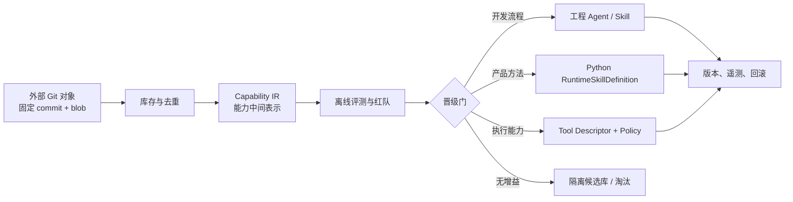

# EXT 能力蒸馏与晋级系统设计

## 状态与前提

本设计以 `origin/feature-chaotang-ext` 作为用户所称“EXP 仓”的候选来源，以当前
`ext-dev` / `origin/dev` 为目标。源身份改变时必须重跑盘点，不得沿用本结论。

当前目标仓已经拥有两套不同性质的能力系统：

1. `.agents/skills`、`.claude/agents` 是开发期工程控制面；
2. `backend/app/agents/runtime_skills` 是产品运行期的类型化能力内核；
3. Runtime 的 Tool Registry、Policy Gateway、Result Gate 是执行权限面。

EXT 的 Markdown Agent/Skill 只能作为不可信候选知识，不能直接成为上述任一事实源。

## 决策

采用“能力编译器”，而不是“Prompt 搬家”。每个外部资产依次经过：

## 双平面与四层模型

候选控制面可以动态读取、去重和评测 EXP；生产执行面继续只认审核后、内容寻址、精确版本
锁定的静态注册表。候选永远不能因为被扫描、得分高或被 Agent 推荐就进入产品上下文或取得
工具权限。

开发期自适应 Skill 路由与产品 Runtime Skill 路由保持分离。两者可共享质量术语和遥测字段，
但不能共享 authority、registry 或发布节奏。

### 1. Source Artifact

保存来源 ref、commit、path、blob、SHA-256、许可证/作者、抓取时间和信任等级。源文本永远
视为不可信数据；其中的工具指令、路径、权限声明和“必须执行”都不继承。

### 2. Capability IR

外部 Prompt 先蒸馏为结构化中间表示：

- `capability_id`、`version`、`owner`、`layer`；
- 触发条件、问题边界、必要输入、允许输出；
- 分析步骤、必需发现、拒绝条件和降级行为；
- 数据域、证据要求、敏感度、副作用等级；
- 候选工具需求，但不包含真实凭据或授权；
- 来源映射和每条规则的证据片段；
- 正例、反例、对抗例和预期评分 rubric。

IR 是迁移审查对象；原 Prompt 不是。

### 3. Target Adapter

- 工程方法适配到当前自适应 `codex-engineering-workflow`，优先合并既有角色；
- 产品专业方法适配到冻结的 `RuntimeSkillDefinition` / `BureauRuntimeSkillSpec`；
- 工具能力单独进入 Tool Registry，并在发现和执行两次做确定性授权；
- 设计规范和质量规则优先编译成测试、lint、rubric 或 Result Gate。

### 4. Evidence Ledger

每次候选晋级必须保存：基线版本、候选版本、数据集版本、模型版本、温度/推理配置、完整
trace 指纹、逐项分数、成本、时延、安全失败和人工复核。只保存“平均更好”不够；必须证明
关键安全切片不退化。

每个能力胶囊分别保存四个哈希：`prompt_digest`、`contract_digest`、`policy_digest` 和
`eval_digest`。小型表达修改不得偷偷改变契约；权限变化必须单独审批；评测集变化必须重新
建立基线。

## 去重策略

依次使用四种指纹，禁止只按文件名：

1. Git blob / SHA-256：完全相同内容；
2. 规范化结构指纹：去 frontmatter、空白和部门名称后的模板重复；
3. Capability IR 指纹：相同输入、输出、步骤、权限和失败语义；
4. 行为指纹：在同一评测集上的工具选择和输出 rubric 表现。

同一能力的部门变体应成为“共享方法 + 部门参数/政策”，只有确有独特数据、工具或判断标准
时才保留独立实现。

## 首批五项

### P1 真实性与决策质量门

- 来源：`gongbu-quality-gate` 中 LIVE/FALLBACK/DEMO、缺证、冲突、下一步和人工确认规则。
- 目标：优先变成共享 rubric、schema 断言和负向测试；少量不可自动化判断才进入 reviewer。
- 非目标：不复制其旧 office-kit/knip 路径说明。
- 晋级：20 个正常案例 + 20 个欺骗/缺证案例；关键安全漏检为 0，正常案例误杀率不高于 5%。

### P2 当前架构能力地图

- 来源：`dept-capability-map` 的“读代码、不信 census”原则。
- 目标：读取当前 Python Runtime Skill、Tool Registry 和测试覆盖，输出事实清单。
- 非目标：不恢复 EXT 的 `real_department_engines.py`、`departments.yaml` 或旧 loop。
- 晋级：对故意制造的缺注册、重复 ID、无测试、权限漂移探针全部失败关闭。

### P3 前端体验审查契约

- 来源：`chaotang-frontend-design` 的复用、真实渲染、响应式截图和诚实标识原则。
- 目标：提炼成当前 frontend 事实源下的视觉 rubric 和浏览器验收，不继承旧组件名或端口。
- 非目标：不冻结未经当前 DEV 确认的视觉 token。
- 晋级：320/768/1440 三档关键任务截图和交互 trace；无阻断级可用性回归。

### P4 真实 E2E 关键旅程

- 来源：`gongbu-e2e-inspector` 的关键旅程、截图、控制台和证据链检查方法。
- 目标：从当前 DEV 路由和 ADR 0028 自动发现验收路径，归入现有 `test-engineer`，验证页面、
  BFF、后端、证据和史馆回奏的一致性。
- 非目标：不继承 EXT 旧路由、端口或浏览器命令，不新增独立工程 Agent。
- 晋级：核心旅程正例、失败关闭、跨 owner、超时和缺证案例全部具备可复现证据；不得用 mock
  前端证明真实后端链路。

### P5 发布证据模板

- 来源：`gongbu-release-scribe` 的变更、验证、风险、未验证范围和回滚表达。
- 目标：并入现有 `product-flow` 和任务 Implementation Report，形成结构化、可机器检查的交付
  证据，不新增 release agent。
- 非目标：不授予 commit、push、merge 或 deploy 权限。
- 晋级：对故意缺少命令结果、混用旧日志、漏报风险和假报通过的样例全部拒绝；正常小改保持
  简洁。

## 评测设计

采用“黄金任务 + 扰动 + 对抗 + 影子流量”四层数据集：

- 黄金任务由当前真实业务案例脱敏而来，按事实正确性、证据、边界、行动性分层 rubric；
- 扰动集改变部门名、顺序、缺失字段和冲突证据，防止记模板；
- 对抗集将 Prompt Injection 放入文件、工具结果和候选 Skill 文本；
- 影子流量只比较结果和 trace，不产生外部动作或用户可见事实。

自动 judge 只能做候选评分；安全门、权限、schema 和确定性事实使用代码判定。LLM judge 必须
先通过独立 judge 校准集，报告与人工标签的一致率和置信区间。

## 供应链与安全

- 所有来源固定到 commit/blob；源更新不自动晋级；
- 开发 Skill、Runtime Skill 和 Tool 权限分别签名/指纹，不允许一个包同时声明三者；
- 外部文本永远不能修改 `agent_id`、owner、tenant、授权、预算、凭据、provider 或审计字段；
- 工具可见目录采用最小权限交集，执行入口再次鉴权；
- Prompt 级防护只作辅助，真正边界由 capability restriction、provenance projection 和
  output/result validation 执行；
- 会话读取网页、附件、MCP 描述或外部 Skill 后标记为 tainted，并动态收紧工具面；高风险写
  操作需要 step-up approval 或直接禁止，不能靠模型自称“已忽略恶意指令”解除污染状态；
- 任何凭据、真实外网、生产写入和副作用工具都需要独立 ADR 与用户授权。

## 可观测与回滚

按 `capability_id + version + model + dataset` 记录：触发率、成功率、降级率、安全拦截、人工
推翻率、成本、P50/P95 时延、上下文 token 和工具错误分类。晋级采用 canary/影子模式，旧版
至少保留一个回滚窗口；版本变化禁止静默覆盖。

## 天才设计：反事实能力市场

不要让路由器只选“最像的 Skill”。对同一脱敏任务并行运行基线与少量候选，但只有基线结果
可进入正式链路；用 rubric、成本和风险形成反事实收益。候选只有在多个任务切片持续产生正
收益时才获得更高流量。这把“谁写的 Prompt 更有气势”变成“谁在真实任务上创造可验证增益”。

## 天才设计：能力预算不是 Prompt 数量

每条旨意拥有四种预算：上下文、模型调用、工具调用和风险。路由器根据剩余预算选择最小能力
组合；Skill 只能申请预算，不能自行扩大预算。高质量通用 Agent + 小型按需能力包通常优于
几十个常驻人设 Agent。

## 天才设计：上下文租金与删除预算

路由器先判断“不加载任何 Skill”是否已经足够。每个候选按预期边际质量增益减去 token、延迟、
风险和维护成本支付上下文租金；无法证明净增益就不加载。每晋级一个正式能力，必须同时审查
能否合并或淘汰至少一个旧项，防止能力库存只增不减。

## 第二批预研，不在本任务晋级

运行角色另开评测轨道，优先研究 `contract_counsel`、`finance_risk`、
`requirements_analyst`、`expert_review_gate` 和 `executive_summary`。它们只能与当前
Python Runtime Skills 做差异蒸馏，不能与工程 Skill 共用评测或发布流程。

## 实施门

进入任何 Runtime 迁移前必须同时满足：

1. 用户确认 EXP 来源身份；当前 `origin/feature-chaotang-ext` 只是候选解释；
2. 恢复或正式替代当前缺失的执行权威入口；
3. 机器清单固定 source commit；
4. 首批候选评测集和安全切片获批；
5. 独立 reviewer 通过；
6. 根 Harness、自测和对应 backend/frontend 验证通过；
7. 同一最终版本按仓库规则连续完整通过 10 轮。

## 本阶段明确不做

- 不 merge `origin/feature-chaotang-ext`；
- 不覆盖 `AGENTS.md`、`.agents`、`.claude` 或 settings/hooks；
- 不把 72 个角色和 367 份 Skill 加入上下文或注册表；
- 不修改 ADR 0028；
- 不启用外网、MCP 写能力、生产数据、凭据或部署。
